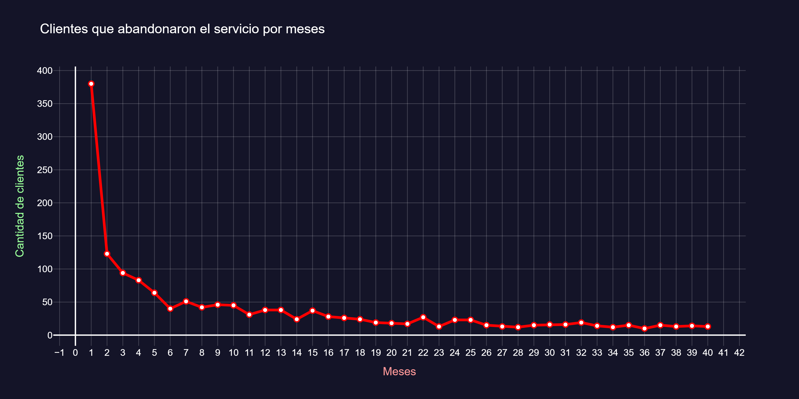

# Análisis de Churn de Clientes – TelecomX LATAM 📉

Este proyecto presenta un análisis de datos enfocado en comprender las **bajas de clientes (churn)** dentro de una empresa de telecomunicaciones en Latinoamérica. A partir de datos históricos, se busca identificar patrones y factores asociados a la pérdida de clientes, con el objetivo de generar insights accionables.

---
---

## 🎯 Objetivo del análisis

El propósito de este análisis es:

- Analizar el comportamiento de los clientes que abandonan el servicio.
- Identificar variables con mayor impacto en el churn.
- Detectar patrones y tendencias relevantes mediante análisis exploratorio.
- Apoyar la toma de decisiones estratégicas orientadas a la retención de clientes.

---
---


## 🗂️ Estructura del proyecto
```
├── TelecomX_LATAM.ipynb
├── README.md
├── TelecomX_Data.json
├── TelecomX_diccionario.md
├── images/
│ ├── churn_por_mes.png
```


## 📊 Gráficos clave

### Churn por meses de contrato



**Insight:**  
Los clientes con menor antigüedad presentan una mayor propensión a la baja, indicando un período crítico durante las primeras etapas del servicio.

---

---

## ▶️ Cómo ejecutar el proyecto (Google Colab)

1. Acceder a https://colab.research.google.com
2. Seleccionar **File → Open notebook**
3. Ir a la pestaña **GitHub** y pegar la URL del repositorio
4. Abrir `TelecomX_LATAM.ipynb`
5. Ejecutar las celdas en orden

---
---

## 📌 Conclusiones

El análisis permite identificar factores relevantes asociados al churn y proporciona una base sólida para el diseño de estrategias orientadas a mejorar la retención de clientes y optimizar la experiencia del usuario.
